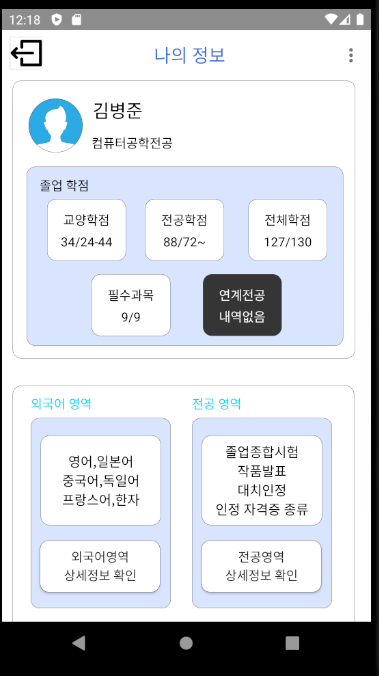
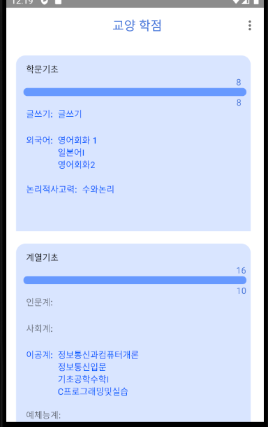
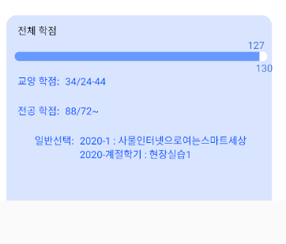
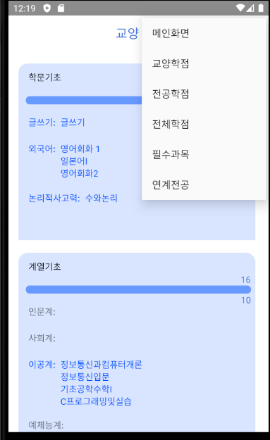

# Jnu graduate
**language**: Java

**IDE:** Android Studio

**part:** front_end

소스코드:https://github.com/kohyerim/jnu_graduate

### 개요

제주대학교의 전산처리시스템 하영드리미에서 접속할때 사용한 session값을 기초해서

하영드리미에게 들은 학기정보를 요청한뒤 기존의 졸업관련 요건들을 비교-대조후 졸업이 가능한지 불가능한지 수치적으로 보여주는 목적의 app개발

### 역할

front -end 로써 Mock으로 미리 정해진 디자인대로 디자인하고 back-end 에서 가져온 데이터를 파싱해서 동적으로 view 에 할당하는 역할을 맡음

## 프로젝트

#### 메인페이지

메인 페이지 

졸업학점 내부의 교양학점 전공학점 전체학점을 미리 생성한 view에 할당

#### 상세페이지

프로그래스바와 가져온 데이터들중 자신에 들은 과목에 해당하는것을 매칭짓고 view에 할당

과목들의 학점에 맞추어 progress bar와 현재 단계에따라 숫자의 위치를 조절

#### 버튼생성

그리고 각 학점으로 빠르게 갈수 잇는 quick 매뉴 설정

### 소감

이때당시 처음으로 안드로이드 스튜디오를 제대로 만져보고 미숙한 자바 실력으로 코딩을 했었는데 처음 막막했던것과는 달리

어떻게 하려고 하면 할수 있고 구글에 스스로 검색을 하면서 스스로 개발을 진행 할수 있어서 개발자에대한 자신감을 조금이나마 불어넣어준 프로젝트였음

